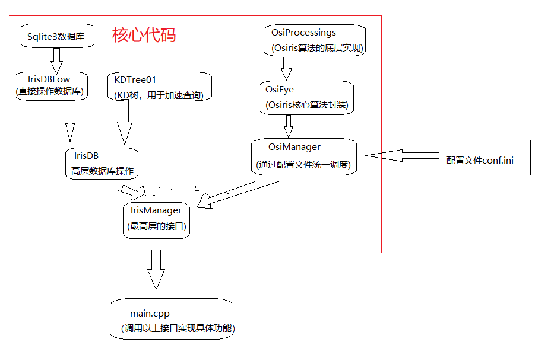

# Iris Recognition
  This project is forked from osiris v4.1.
  Here is my job:
* use sqlite3 + kd-tree to speed up query
* modify/delete some code to speed up iris detection
* achieve real-time iris insert/query/delete operation in a normal computer.

# STRUCTURE

# database
* sqlite3 is used to store iris feature
* database file is in ./IrisDB/iris.db(you can change it by modify the value of "sqlite3DB" in the config file(lied in ./conf/conf.ini)
* database only contain one table,two fields. you can see its defination in the sql script(lied in ./scripts/iris.sql)

# How to use it ?
* cd ./src
* make
* ./osiris
# after running ./osiris you can do the following operations(the implementation is in ./src main.cpp)
* insert 1.jpg   //insert a iris image into database,and reture a ID which is discriminantive.
* query  2.jpg   //find the nearest iris image from sqlite3 database.
* delete [id]          //
# paper
* High confidence visual recognition of persons by a test of statistical Independency
* OSIRIS An open source iris recognition software
* The Viterbi Algorithm at Different Resolutions for Enhanced Iris Segmentation
* Documentation_OSIRIS_v4.1
